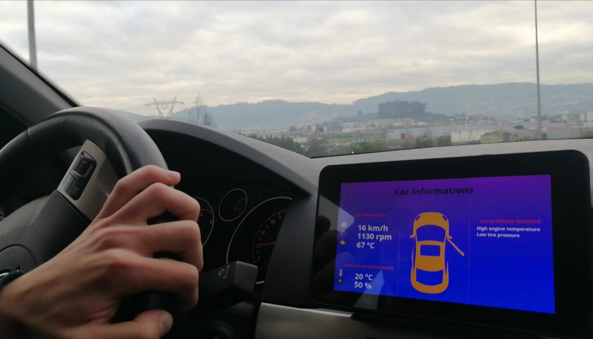
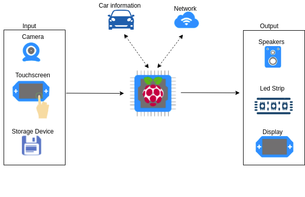
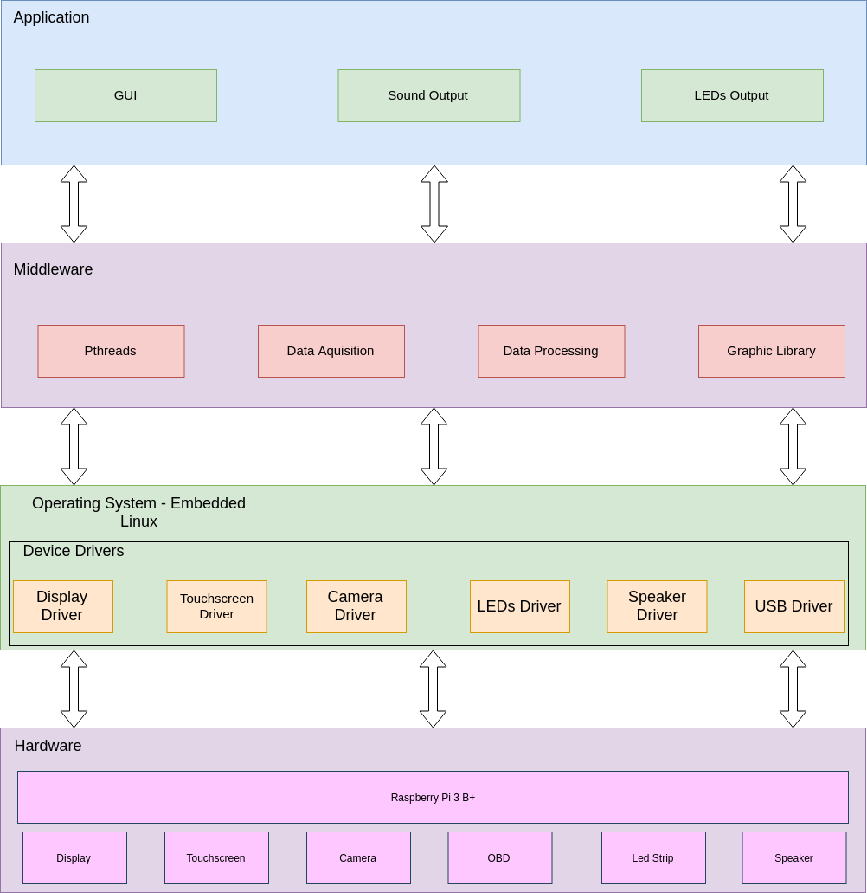

<h1> Car Dashboard </h1>

 A Car Dashboard was developed to present the most important information about the car in a simple way.

* Reproduce music from Storage Device or USB flash drive
* Interaction with Touchscreen
* Display car-related information
  - Speed, fuel level, rpm, etc
  - Car backward camera
* Search and display Network information
  - Weather
  - News
* Control Led Strip

<h1 align="center">
    
</h1>

 The system is rooted on Raspberry running Embedded Linux with several applications which interact with them and the user.
For those interactions be possible we need sensors to read and take info from user and then send to the main core, Raspberry, and be processed to take an action to an output. The system inputs will be the camera (Capture real time video), Car Sensors (Take car information through serial bus connection), Storage Device (Music files saved for being readable by system) and Touchscreen (User friendly interface). The system outputs will be Speakers (Jack plug output, audio car alerts), Display (Visual information of the system) and Led Strip (To create ambient light).

<h1 align="center">
    
</h1>

<h2> Software Resources </h2>

 About software, this system uses a custom Embedded Linux so some drivers are required, in this case the specifics drivers are: Bluetooth, Wireless, Touchscreen, speakers and storage device drivers. The processing of APIs, the Pthreads and GUI libraries are in the Middleware Layer. The system has a program that convert the commands from the user through the touchscreen car dashboard. The information will be displayed using the GUI libraries as support.

 The Hardware layer contains a Raspberry PI board and all the hardware components. Those hardware modules will be connected to the Raspberry which has the Embedded Linux Operating System running. The OS is built by Buildroot and contains all the device drivers needed for hardware communication. In the Middleware layer we have all the libraries needed to provide services to the Application layer. The Application layer contains the user interface, and the outputs of the system with the user, Sound and Led Strip outputs.

<h1 align="center">
    
</h1>

- [ ✔ ] Buildroot - cross compiling development

- [ ✔ ] PThreads - library for threads implementation

- [ ✔ ] Sound API

- [ ✔ ] QT/QML - Graphical User Interface

- [ ✔ ] C/C++ Object Oriented

- [ ✔ ] Embedded Linux - Operating System

 
<h4 align="center">
    Contribution with ❤ from pedromiguelcp. Project no longer under development. 🏁
</h4>
